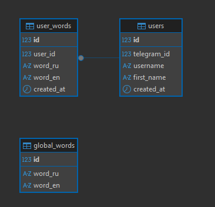

#  Telegram Bot "EnglishCard"

**Курсовая работа по модулю «Базы данных»**

Бот для изучения английских слов с интеграцией базы данных PostgreSQL. Проект демонстрирует навыки работы с Python, библиотекой `pyTelegramBotAPI`, СУБД PostgreSQL и системой контроля версий Git.

## 🚀 Функционал бота

Бот предоставляет удобный интерфейс для изучения языка через интерактивное меню:

*   **➕ Добавление слов:** Пользователь может создавать свой личный словарь, добавляя пары слов (Русский → Английский).
*   **📚 Режим обучения (Викторина):** Бот предлагает перевести случайное слово из общего словаря или личного списка. Ответы выбираются через удобные кнопки (4 варианта).
*   **❌ Управление словами:** Просмотр списка личных слов и их удаление. Удаление работает персонально для каждого пользователя.
*   **📊 Статистика:** После добавления слова бот сообщает общее количество изучаемых слов.
*   **👤 Регистрация:** Автоматическая регистрация новых пользователей при первом запуске (`/start`).

## 🗄️ Архитектура базы данных

Проект использует реляционную базу данных **PostgreSQL**. Структура БД состоит из трех основных таблиц:

1.  **`users`**: Хранит данные пользователей Telegram (ID, имя, username).
2.  **`global_words`**: Общий словарь слов для викторины (доступен всем пользователям).
3.  **`user_words`**: Персональные слова


## 🛠️ Технологии и инструменты

*   **Язык программирования:** Python 3.9+
*   **Библиотеки:**
    *   `pyTelegramBotAPI` — для взаимодействия с Telegram API.
    *   `psycopg2-binary` — драйвер для подключения к PostgreSQL.
*   **База данных:** PostgreSQL + DBeaver (для управления).
*   **IDE:** PyCharm.
*   **Контроль версий:** Git + GitHub.

## 📦 Установка и запуск

Чтобы запустить проект локально, выполните следующие шаги:

## Шаг 1. Клонирование репозитория

```bash
git clone https://github.com/Serg-cxz/Finaly_work_BD_TGBOT.git
cd Finaly_work_BD_TGBOT
```


## Шаг 2: Создание файла окружения
Создайте файл .env с необходимыми переменными

## Токен бота (получить у @BotFather)
```bash
BOT_TOKEN=your_telegram_bot_token_here
```
## Настройки прокси (опционально, для регионов с ограниченным доступом)
```bash
PROXY_HOST=
PROXY_PORT=
```
## Настройки базы данных
```bash
DB_USER=your_db_user_name
DB_PASSWORD=your_secure_password
DB_NAME=your_db_namet
DB_HOST=localhost
DB_PORT=your_db_port
DB_ECHO=false
```

## Шаг 3: Запуск бота
Убедитесь, что виртуальное окружение активировано, и запустите главный файл:
```bash
python main.py
```
Если всё настроено верно, в консоли появится сообщение:
````bash
Бот запущен...

````

# 📖 Использование
## Команды и кнопки интерфейса
Поскольку бот использует интерактивное меню, основные действия выполняются через нажатие кнопок, а не ввод текстовых команд.
Элемент интерфейса

Описание действия
* /start - Главная команда. Запускает бота, регистрирует пользователя в базе данных и показывает главное меню.
* ➕ Добавить слово - Запускает процесс добавления новой пары слов. Бот последовательно спросит:
1. Слово на русском.
2. Перевод на английский.

* 📚 Учить слова - Запускает режим викторины. Бот берет случайное слово из общего словаря (global_words) и предлагает 4 варианта перевода на кнопках.
* ❌ Удалить слово  - Показывает список всех личных слов пользователя. Под каждым словом есть кнопка удаления. Нажатие удаляет слово из базы навсегда.
 
## Сценарий работы с ботом
1. Старт: Напишите боту команду /start. Бот поприветствует вас и покажет главное меню.
2. Обучение: Нажмите кнопку 📚 Учить слова.
* Бот пришлет вопрос: "Как переводится слово: [Слово]?"
* Выберите один из 4 вариантов ответа на кнопках.
* Бот сообщит, верно ли вы ответили, и вернет вас в меню.
3. Пополнение словаря: Нажмите кнопку ➕ Добавить слово.
* Введите слово на русском (например: Кот).
* Введите его перевод на английском (например: Cat).
* Бот подтвердит сохранение и покажет общее количество ваших слов.
4. Управление: Если нужно убрать слово из списка, нажмите ❌ Удалить слово, найдите нужное в списке и нажмите кнопку удаления рядом с ним.
## Особенности работы
* Персонализация: Все добавленные слова сохраняются только для вашего Telegram-ID. Другие пользователи их не видят.
* Викторина: Вопросы формируются из таблицы global_words, которая заполняется администратором (через SQL-скрипт при развертывании).
* База данных: Все действия (регистрация, добавление, удаление) мгновенно отражаются в PostgreSQL. Вы можете проверить данные в реальном времени через DBeaver.

## 🗄️ Схема базы данных

Проект использует реляционную модель данных в PostgreSQL. Структура состоит из трех связанных таблиц:

### Таблица `users`
Хранит информацию о пользователях Telegram.
*   `id` (SERIAL, PK): Внутренний уникальный идентификатор записи.
*   `telegram_id` (BIGINT, UNIQUE): ID пользователя в Telegram (используется для связи).
*   `username` (VARCHAR): Никнейм пользователя.
*   `first_name` (VARCHAR): Имя пользователя.
*   `created_at` (TIMESTAMP): Дата регистрации.

### Таблица `global_words`
Общий словарь слов для викторины. Доступен всем пользователям.
*   `id` (SERIAL, PK): Уникальный идентификатор слова.
*   `word_ru` (VARCHAR): Слово на русском языке.
*   `word_en` (VARCHAR): Перевод на английский язык.

### Таблица `user_words`
Персональные слова, добавленные конкретным пользователем.
*   `id` (SERIAL, PK): Уникальный идентификатор записи.
*   `user_id` (INTEGER, FK): Ссылка на `id` из таблицы `users` (внешний ключ).
*   `word_ru` (VARCHAR): Слово на русском.
*   `word_en` (VARCHAR): Перевод на английский.
*   `created_at` (TIMESTAMP): Дата добавления.


**Связи:** Таблица `user_words` связана с `users` отношением "Один-ко-многим" (один пользователь может иметь много слов). Внешний ключ обеспечивает целостность данных: при удалении пользователя его слова также удаляются (`ON DELETE CASCADE`).

## 🏗️ Архитектура проекта

Приложение построено по модульному принципу для удобства поддержки и расширения:

```text
┌─────────────┐     ┌──────────────┐     ┌─────────────┐
│  Telegram   │────▶│   Bot App    │────▶│  PostgreSQL │
│   Client    │     │  (Python)    │     │   Database  │
└─────────────┘     └──────────────┘     └─────────────┘


```
 


## 📜 Лицензия
### Учебный проект, разработанный в рамках курса «Базы данных». Код распространяется свободно для образовательных целей.
👤 Контакты
Автор: Сергей
GitHub: Serg-cxz

* По вопросам и предложениям создавайте Issue в репозитории.


